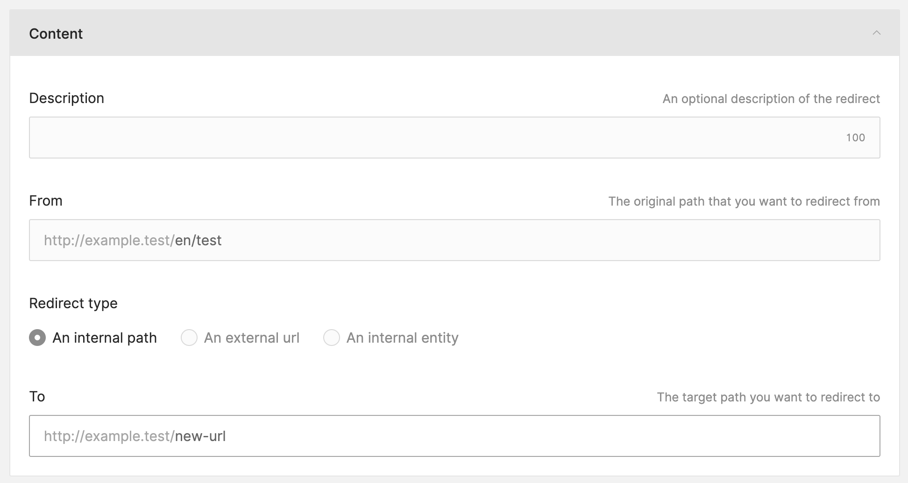

# Twill redirects

This package adds a redirects functionality to your Twill installation.



## Installation

Install it via composer:

```
composer require sevendays-digital/twill-redirects
```

(optional but required if redirecting to other modules) Then publish the config and set the modules inside:

```
php artisan vendor:publish --tag=twill-redirects-config
```

Finally run the migrations:

```
php artisan migrate
```

## Usage

You can now add redirects via the Twill backend.

Usage depends on your implementation. You can use the `RedirectManager` to figure it out:

```php
<?php
// Get a redirect for a specific request.
RedirectManager::getRedirectForRequest(request());

// Get a redirect for a specific path.
RedirectManager::getRedirectForPath('my/path');
```

Alternatively you can use the middleware if your front-end is served by Laravel by adding it to `Http/Kernel.php`:

```php
    protected $middlewareGroups = [
        'web' => [
            ...
            TwillRedirectMiddleware::class,
            ...
        ]
   ];
```

This will automatically take care of the redirect if there's a match.

But there is one exception, which is when you are using the `browser` to select the destination.

For that the package will not be able to return more than the slug out of the box, but you can manually intercept that
to handle the redirect.

In you `AppServiceProvider` you can add this to the `register` method:

```
// Example:
RedirectManager::onTwillEntityRedirect(
    function(Model $model) {
        if ($model instance ExampleModel) {
          return route('my.route', ['id' => $model->id]);
        }
        return $model->slug ?? '';
    }
)
```

